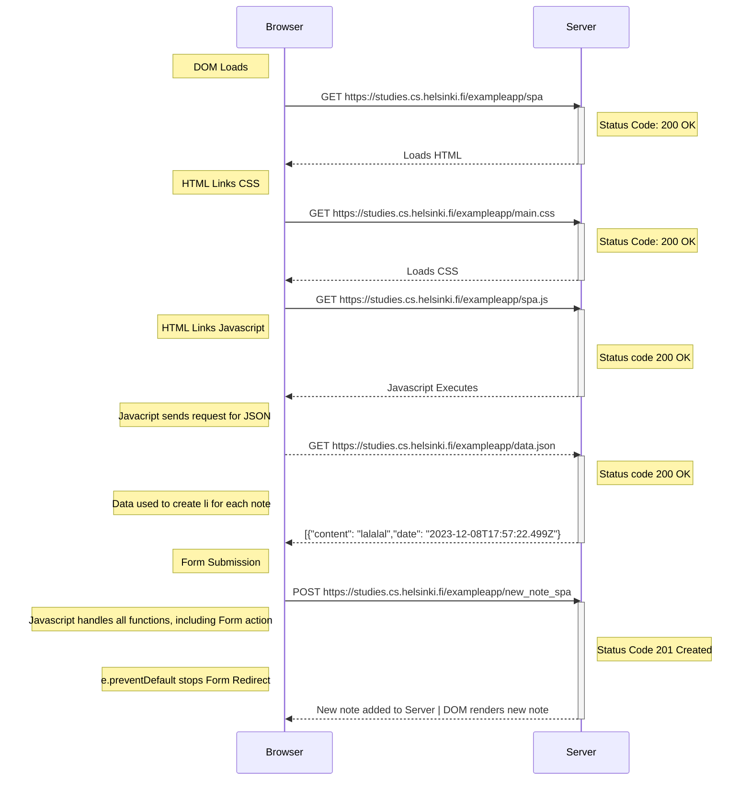

```mermaid
sequenceDiagram

    Participant Browser
    Participant Server

    Note left of Browser: DOM Loads

    Browser->>Server: GET https://studies.cs.helsinki.fi/exampleapp/spa
    activate Server
    Note right of Server: Status Code: 200 OK
    Server-->>Browser: Loads HTML
    deactivate Server

    Note left of Browser: HTML Links CSS
    Browser->>Server: GET https://studies.cs.helsinki.fi/exampleapp/main.css
    activate Server
    Note right of Server: Status Code: 200 OK
    Server-->>Browser: Loads CSS
    deactivate Server

    Browser->>Server: GET https://studies.cs.helsinki.fi/exampleapp/spa.js
    activate Server
    Note left of Browser: HTML Links Javascript
    Note right of Server: Status code 200 OK
    Server-->>Browser: Javascript Executes
    deactivate Server

    
    Note left of Browser: Javacript sends request for JSON
    
    Browser-->>Server: GET https://studies.cs.helsinki.fi/exampleapp/data.json
    activate Server
    Note right of Server: Status code 200 OK
    Note left of Browser: Data used to create li for each note
    Server-->>Browser: [{"content": "lalalal","date": "2023-12-08T17:57:22.499Z"}
    Deactivate Server

    Note left of Browser: Form Submission

    Browser->>Server: POST https://studies.cs.helsinki.fi/exampleapp/new_note_spa
    activate Server
    Note left of Browser: Javascript handles all functions, including Form action
    Note right of Server: Status Code 201 Created
    Note left of Browser: e.preventDefault stops Form Redirect
    Server-->>Browser:  New note added to Server | DOM renders new note 
    deactivate Server
```
