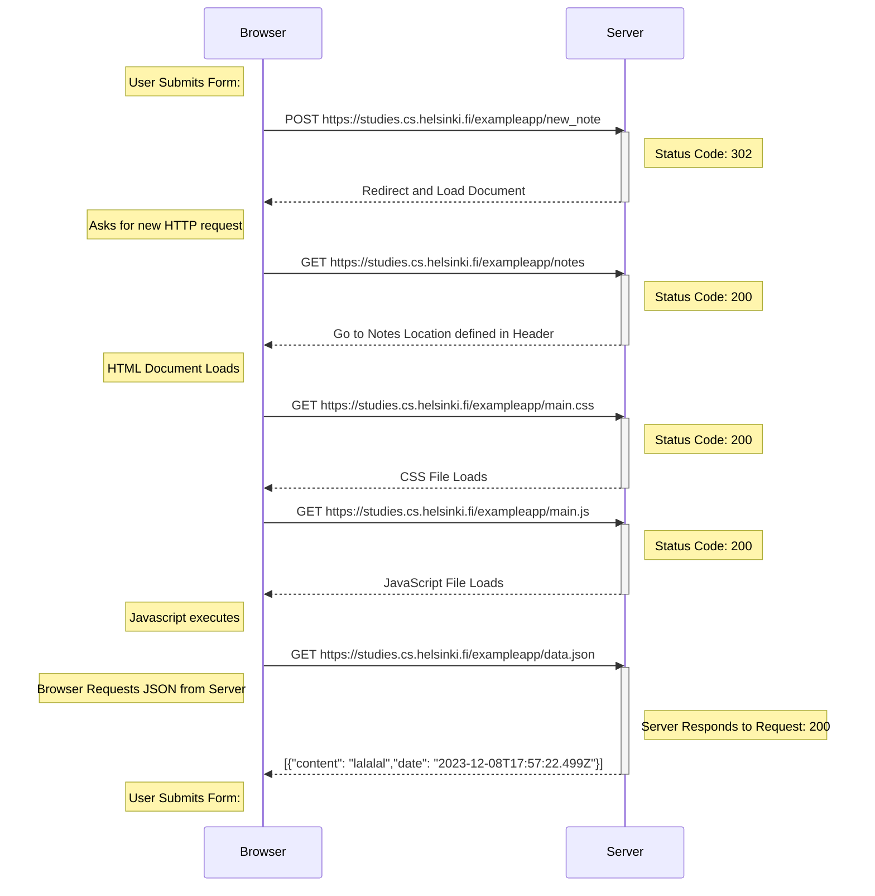

```mermaid
sequenceDiagram
    Participant Browser
    Participant Server
    
    Note left of Browser: User Submits Form:
    Browser->>Server: POST https://studies.cs.helsinki.fi/exampleapp/new_note
    activate Server
    Note right of Server: Status Code: 302
    Server-->>Browser: Redirect and Load Document
    deactivate Server
    Note left of Browser: Asks for new HTTP request

    Browser->>Server: GET https://studies.cs.helsinki.fi/exampleapp/notes
    activate Server
    Note right of Server: Status Code: 200
    Server-->>Browser: Go to Notes Location defined in Header
    deactivate Server
    Note left of Browser: HTML Document Loads

    Browser->>Server: GET https://studies.cs.helsinki.fi/exampleapp/main.css
    activate Server
    Note right of Server: Status Code: 200
    Server-->>Browser: CSS File Loads
    deactivate Server

    Browser->>Server: GET https://studies.cs.helsinki.fi/exampleapp/main.js
    activate Server
    Note right of Server: Status Code: 200
    Server-->>Browser: JavaScript File Loads
    deactivate Server

    note left of Browser: Javascript executes

    Browser->>Server: GET https://studies.cs.helsinki.fi/exampleapp/data.json
    activate Server
    note left of Browser: Browser Requests JSON from Server
    Note right of Server: Server Responds to Request: 200
    Server-->>Browser: [{"content": "lalalal","date": "2023-12-08T17:57:22.499Z"}]
    deactivate Server

    Note left of Browser: User Submits Form:
    
```
